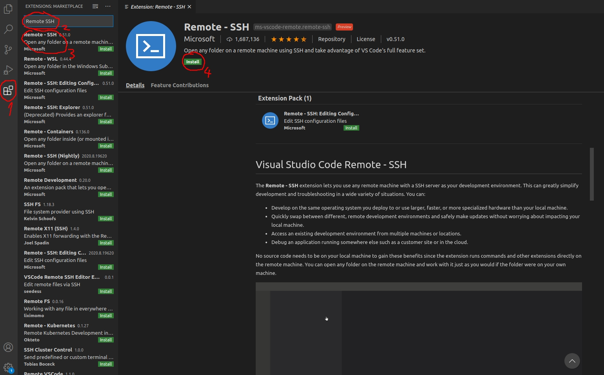
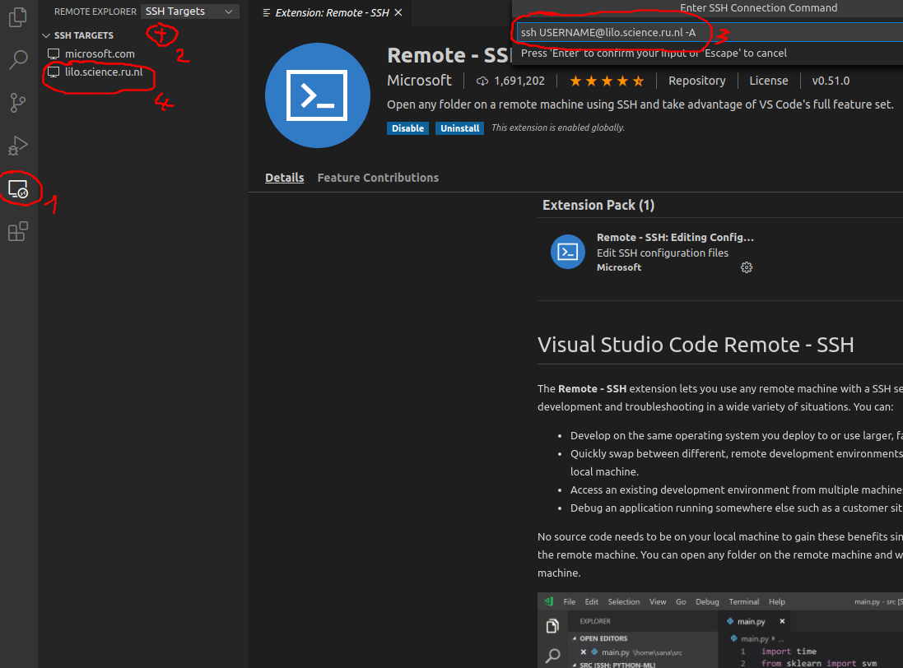

# Assignment 1: shell
## Operating Systems

For the assignments we will use Visual Studio Code and a UNIX C++ development environment. You can read about UNIX or install the development environment.

Note: if you have additions or changes, please send them to us.

### Linux

Already using Linux? Great! A couple of small steps are left:

- Install Visual Studio Code. See https://code.visualstudio.com/docs/setup/linux. Make sure you also install the following extensions:
  - C/C++ extension from Microsoft
  - CMake Tools extension
- Make sure you have a C++ dev environment. For Ubuntu: 
  `sudo apt-get update`   
  `sudo apt-get install -y build-essential g++ gdb cmake make git`
- Download the project files with the follow command:  
  `git clone https://gitlab.science.ru.nl/operatingsystems/assignment1.git`
- Open the folder `assignment1/project` in Visual Studio Code.

### macOS

So, macOS is built on the UNIX foundation. So it is also quite easy.

- Make sure you have installed Xcode from Apple (use the App Store for this).
- Make Xcode available in the terminal (iTerm2 is a good terminal application for macOS):  
  `xcode-select --install`
- If you don't have HomeBrew installed, do it: https://brew.sh/
- Next, install the dependencies with these commands:  
  `brew install cmake git`  
  `brew install --cask visual-studio-code`
- Install the following Visual Studio Code extensions:
  - C/C++ extension from Microsoft
  - CMake Tools extension
- Download the project files with the follow command:  
  `git clone https://gitlab.science.ru.nl/operatingsystems/assignment1.git`
- Open the folder `assignment1/project` in Visual Studio Code.

### Windows

So, Windows is not from the UNIX heritage, so the setup is more involved. In any case you need Visual Studio Code (https://code.visualstudio.com/download). Visual Studio is your local editor, but all the code is executed in another environment, called the 'remote'. This remote environment can be running locally in a virtual machine, in a container, or really remotely using SSH. Visual Studio Code uses a lot of extensions, these are either editor extensions (running locally) or programming extensions (running remotely). So take care that you install the extensions in the right way. And make sure you are connected to the remote environment: check the bottom left green box, should be some text inside it. If not press the green button and select 'Reopen Folder in WSL' option.

Basically, you have three options. *Pick one of these three*.

- Use Windows Subsystem for Linux on Windows 10: provided by Microsoft, it allows you to directly develop and run UNIX programs on Windows. A tutorial is available online (https://code.visualstudio.com/docs/remote/wsl-tutorial). You need version 2 of WSL. **Note: VirtualBox is incompatible with WSL2.** (if by accident VirtualBox is not working anymore, try to uninstall the Hyper-V Windows feature). To install WSL 2:
        1. For WSL2 update to Windows 10 version 20.04
        2. in powershell admin: `dism.exe /online /enable-feature /featurename:Microsoft-Windows-Subsystem-Linux /all /norestart`
        3. in powershell admin: `dism.exe /online /enable-feature /featurename:VirtualMachinePlatform /all /norestart`
        4. reboot
        5. install the WSL2 kernel component: https://aka.ms/wsl2kernel
        6. set default WSL version to the latest: `wsl --set-default-version 2`
        7. install Ubuntu 20.04 from the Windows Store.
        8. install the _Remote - WSL_ extension in Visual Studio Code.
        9. follow the instructions above under Linux, **after connecting to WSL** which can be done with the green button bottom left (select 'Reopen Folder in WSL' option). When following the Linux instruction, be sure to install the extensions on the remote end.
- Use Docker on Windows 10. Containers are an efficient way (compared to virtual machines) to gather all dependencies and distribute binaries. Docker allows one to edit files in Windows with Visual Studio Code, and use a lightweight Linux container to compile and run your programs. See https://docs.docker.com/docker-for-windows/install/ for installation.  Install the _Remote - Docker_ extension in Visual Studio Code.
- Use SSH to execute commands remotely. There is a Linux login server provided by the university: lilo.science.ru.nl. More details are provided below (under SSH setup instructions).

## SSH Setup Instructions (only needed if other options fail)
Visual Studio Code is a source-code editor made by Microsoft for Windows, Linux and macOS.[7] Features include support for debugging, syntax highlighting, intelligent code completion, snippets, code refactoring, and Git. Users can change the theme, keyboard shortcuts, preferences, and install extensions that add additional functionality.

One of these extensions is called **Remote - SSH**. The **Remote - SSH** extension lets you use any remote machine with a SSH server as your development environment. This can greatly simplify development in a wide variety of situations. No development environment is needed on your local machine to gain these benefits since the Remote extension runs commands and other extensions directly on the remote machine. You can open any folder on the remote machine and work with it just as you would if the folder were on your own machine.

Before you read further, make sure that you installed an [OpenSSH client (Putty is not supported)](https://code.visualstudio.com/docs/remote/troubleshooting#_installing-a-supported-ssh-client).

Note: if you have set up WSL or Docker, you can use the _Remote - WSL_ or the _Remote - Docker_ extensions. They work quite similar as the SSH extension.

##### Setup Visual Studio Code
Download and install Visual Studio Code from this [website](https://code.visualstudio.com/).
Open Visual Code:
1. Click on the extension button on the left side
2. Search for *Remote - SSH*
3. Select it
4. Install *Remote - SSH*


##### Connect to the remote server
Now, we wanna connect to the remote server:
1. Click on new remote button on the left side
2. Click on the plus-button
3. Write in the appeared text field the following: `ssh YOURUSERNAME@lilo.science.ru.nl -A`
4. Right-Click on the new appeard ssh target and connect to the server


Now, you can use Visual Studio Code as it would be on your local machine. You can browse through the folders, open terminals etc.

## Common Visual Studio Code setup

Install now the following extensions on the remote machines visual studio code:
- C/C++ extension from Microsoft
- CMake Tools extension

To get the project files for the assignments, open a terminal in Visual Studio Code (with the menu option). Type in the following commands:
```
git clone https://gitlab.science.ru.nl/OperatingSystems/assignment1.git
```

Next, open this folder (`assignment1/project`) in Visual Studio Code. Your are good to go now, and start with the assignment.
